# Comprehensive Trust Network Algorithm Analysis: Complete Theory and Implementation

## Table of Contents
1. [Introduction and Framework Overview](#1-introduction)
2. [EigenTrust: Theory, Implementation, and Evolution](#2-eigentrust)
3. [Appleseed: Energy-Based Trust Propagation](#3-appleseed)
4. [PageRank: Random Surfer Model](#4-pagerank)
5. [Conductance: Graph Partitioning Metrics](#5-conductance)
6. [Flow Centrality: Random Walk Analysis](#6-flow-centrality)
7. [Hybrid Liquidity: Multi-Objective Optimization](#7-hybrid-liquidity)
8. [Comparative Analysis and Case Studies](#8-comparative-analysis)

---

## 1. Introduction and Framework Overview

### 1.1 The Decentralized Token Network Model

We consider a network where:
- Every node issues its own token
- Nodes accept tokens based on transitive trust relationships
- Converter nodes bridge to off-chain value
- Trust must be computed efficiently at scale

**Formal Network Definition:**

$$\mathcal{N} = (V, E, W, T, B, K, R, \tau)$$

Where:
- $V = \{v_1, v_2, \ldots, v_n\}$: Set of nodes
- $E \subseteq V \times V$: Directed edges
- $W: E \rightarrow (0, 1]$: Trust weight function
- $T = \{T(v) \mid v \in V\}$: Token set
- $B: V \times T \rightarrow \mathbb{R}_+$: Balance function
- $K \subseteq V$: Converter nodes
- $R: K \times T \rightarrow \mathbb{R}_+$: Conversion rates
- $\tau \in (0, 1]$: Acceptance threshold

### 1.2 Trust Computation Pipeline

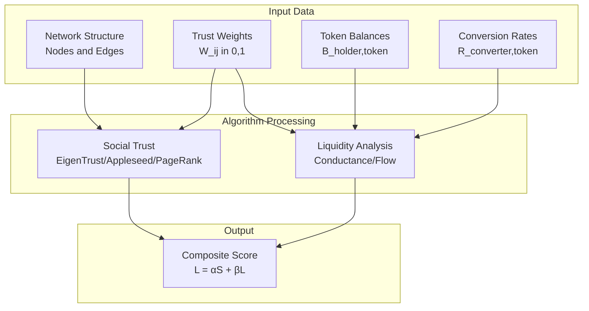

---

## 2. EigenTrust: Theory, Implementation, and Evolution

### 2.1 Complete Theoretical Foundation

#### 2.1.1 The Trust Propagation Problem

EigenTrust solves the fundamental equation:

$$t_i = \sum_{j \in V} c_{ji} \cdot \frac{t_j}{\sum_{k \in V} c_{jk}}$$

This leads to the matrix formulation:

$$\mathbf{t} = \mathbf{C}^T\mathbf{t}$$

Where $\mathbf{C}$ is column-stochastic: $\sum_i C_{ij} = 1$ for all $j$.

#### 2.1.2 The Teleportation Solution

To ensure uniqueness and prevent manipulation:

$$\mathbf{t} = (1-\alpha)\mathbf{C}^T\mathbf{t} + \alpha\mathbf{p}$$

Rearranging:
$$[\mathbf{I} - (1-\alpha)\mathbf{C}^T]\mathbf{t} = \alpha\mathbf{p}$$

Solution:
$$\mathbf{t} = \alpha[\mathbf{I} - (1-\alpha)\mathbf{C}^T]^{-1}\mathbf{p}$$

#### 2.1.3 Convergence Analysis

**Theorem (EigenTrust Convergence):** 
For $\alpha \in (0,1)$, the power iteration:
$$\mathbf{t}^{(k+1)} = (1-\alpha)\mathbf{C}^T\mathbf{t}^{(k)} + \alpha\mathbf{p}$$

converges to the unique solution $\mathbf{t}^*$ at rate:
$$\|\mathbf{t}^{(k)} - \mathbf{t}^*\|_1 \leq (1-\alpha)^k \|\mathbf{t}^{(0)} - \mathbf{t}^*\|_1$$

### 2.2 EigenTrust Algorithm Flow

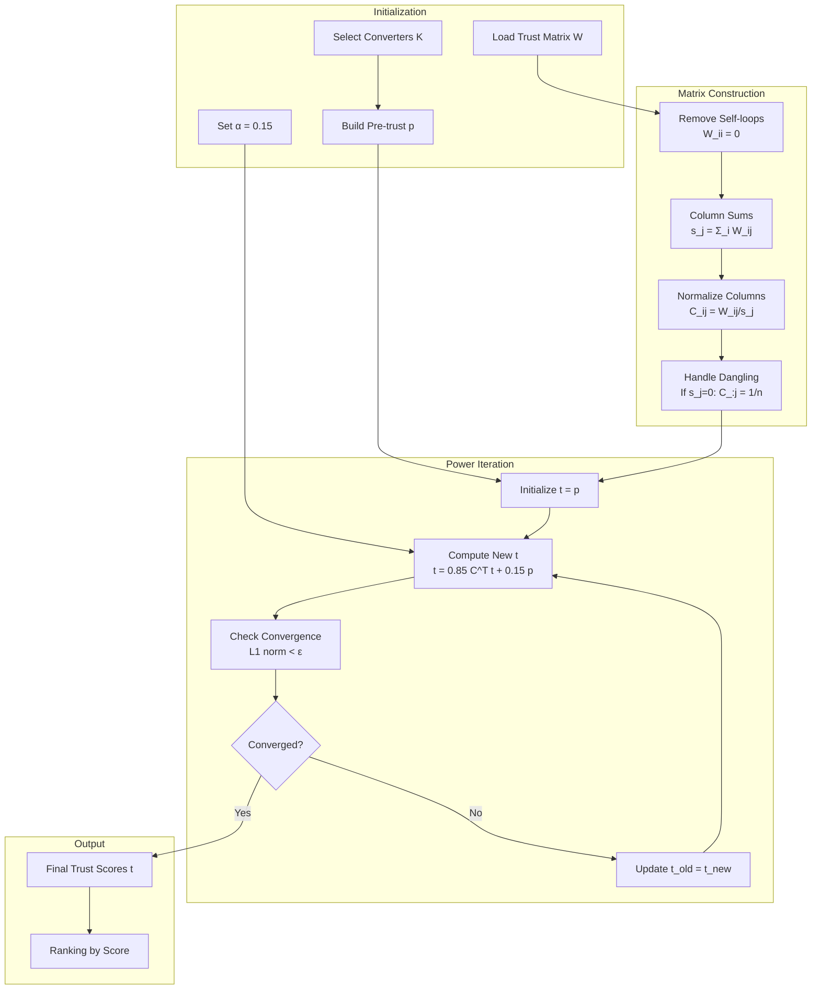

### 2.3 Detailed Numerical Example

Consider a 6-node network with converters at B and D:

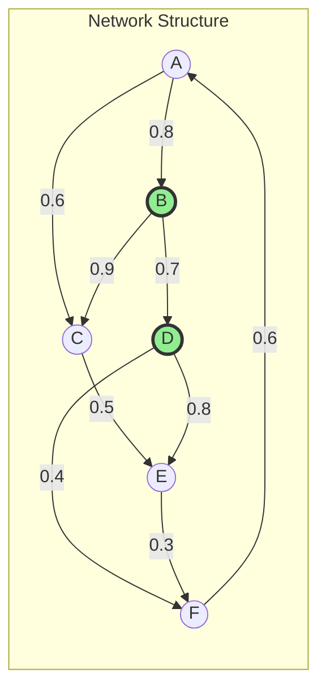

**Trust Matrix W:**
$$\mathbf{W} = \begin{bmatrix}
0 & 0.8 & 0.6 & 0 & 0 & 0 \\
0 & 0 & 0.9 & 0.7 & 0 & 0 \\
0 & 0 & 0 & 0 & 0.5 & 0 \\
0 & 0 & 0 & 0 & 0.8 & 0.4 \\
0 & 0 & 0 & 0 & 0 & 0.3 \\
0.6 & 0 & 0 & 0 & 0 & 0
\end{bmatrix}$$

**Pre-trust vector (concentrated on converters):**
$$\mathbf{p} = [0, 0.5, 0, 0.5, 0, 0]^T$$

**Iteration Evolution:**

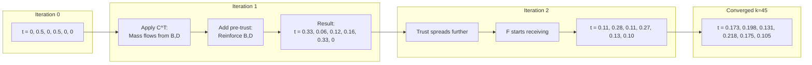

**Convergence Analysis:**

| Iteration | L1 Distance | Max Change | Dominant Nodes |
|-----------|-------------|------------|----------------|
| 0 | - | - | B, D |
| 1 | 1.664 | 0.440 | A, E emerging |
| 2 | 0.873 | 0.219 | B, D recovering |
| 5 | 0.145 | 0.036 | Stabilizing |
| 10 | 0.024 | 0.006 | Near convergence |
| 45 | < 10⁻⁹ | < 10⁻⁹ | Final: D > B > E > A |

### 2.4 Sybil Resistance Analysis

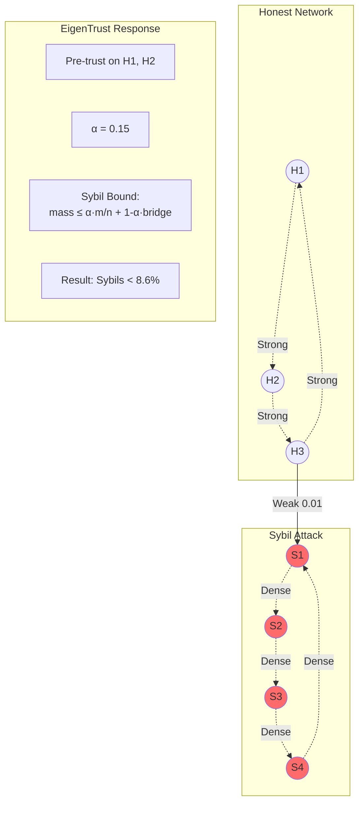

**Sybil Resistance Theorem:**
$$\sum_{s \in \text{Sybil}} t_s \leq \alpha \cdot \frac{|\text{Sybil}|}{n} + (1-\alpha) \cdot \text{Trust}_{\text{honest} \rightarrow \text{Sybil}}$$

With our parameters:
$$\text{Sybil Mass} \leq 0.15 \cdot \frac{4}{7} + 0.85 \cdot 0.01 = 0.086 + 0.0085 = 0.0945$$

---

## 3. Appleseed: Energy-Based Trust Propagation

### 3.1 Complete Theoretical Foundation

#### 3.1.1 Energy Propagation Model

Energy at time $t+1$:
$$e_{t+1}(v) = d \sum_{u \in V} P(u,v) \cdot e_t(u)$$

Where $P(u,v) = \frac{W(u,v)}{\sum_w W(u,w)}$ is the transition probability.

Trust accumulation:
$$s(v) = \sum_{t=0}^{\infty} (1-d) \cdot e_t(v)$$

#### 3.1.2 Closed-Form Solution

**Theorem (Appleseed Convergence):**
$$\mathbf{s} = (1-d)(\mathbf{I} - d\mathbf{P}^T)^{-1}\mathbf{e}_0$$

**Proof:** 
$$\mathbf{s} = (1-d)\sum_{t=0}^{\infty} (d\mathbf{P}^T)^t \mathbf{e}_0 = (1-d)(\mathbf{I} - d\mathbf{P}^T)^{-1}\mathbf{e}_0$$

The series converges since $\|d\mathbf{P}^T\| = d < 1$.

### 3.2 Appleseed Algorithm Flow

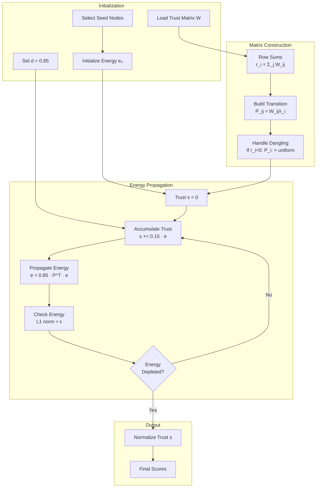

### 3.3 Energy Flow Visualization

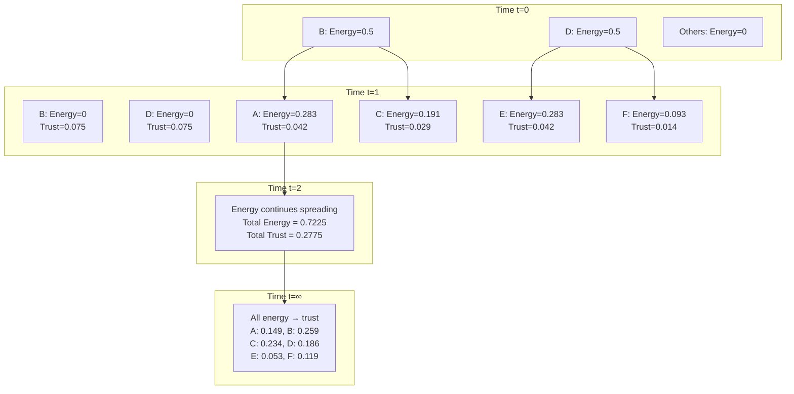

**Energy Conservation Table:**

| Time | Total Energy | Trust Accumulated | Energy Formula |
|------|--------------|-------------------|----------------|
| 0 | 1.000 | 0.000 | $e_0 = 1$ |
| 1 | 0.850 | 0.150 | $e_1 = 0.85^1$ |
| 2 | 0.723 | 0.277 | $e_2 = 0.85^2$ |
| 5 | 0.444 | 0.556 | $e_5 = 0.85^5$ |
| 10 | 0.197 | 0.803 | $e_{10} = 0.85^{10}$ |
| ∞ | 0.000 | 1.000 | $\lim_{t \to \infty} 0.85^t = 0$ |

---

## 4. PageRank: Random Surfer Model

### 4.1 Complete Theoretical Foundation

#### 4.1.1 Random Walk Formulation

PageRank models a random surfer:
$$r_i = d \sum_{j \in V} \frac{W(j,i)}{\text{out}(j)} r_j + \frac{1-d}{n}$$

Matrix form:
$$\mathbf{r} = d\mathbf{P}^T\mathbf{r} + \frac{1-d}{n}\mathbf{e}$$

#### 4.1.2 Dangling Node Problem

For nodes with no outlinks:
$$\mathbf{r} = d\mathbf{S}\mathbf{r} + \frac{1-d}{n}\mathbf{e}$$

Where:
$$\mathbf{S} = \mathbf{P}^T + \frac{1}{n}\mathbf{d}\mathbf{e}^T$$

$\mathbf{d}$ is the dangling indicator vector.

### 4.2 PageRank Algorithm Flow

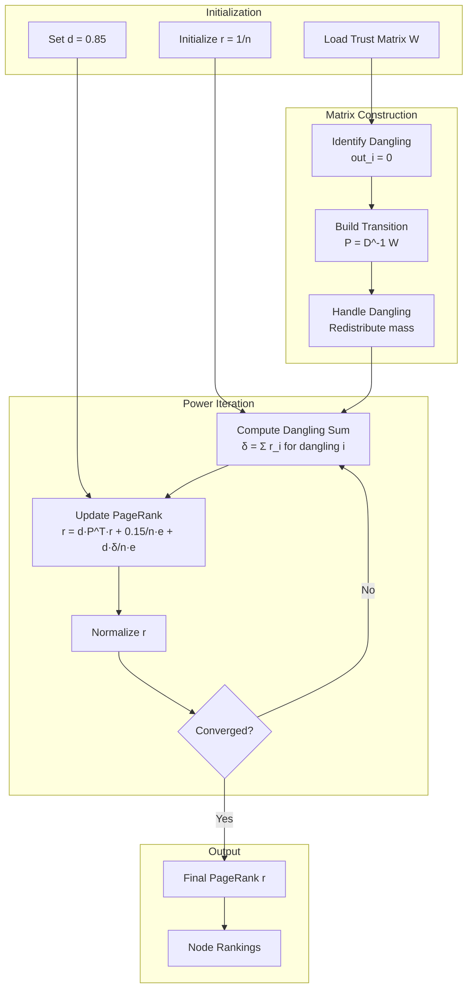

### 4.3 PageRank Evolution Example

Using our 6-node network (E is dangling):

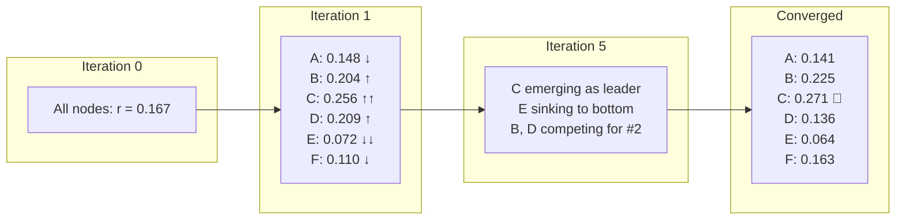

**Dangling Node Redistribution:**

E has no outlinks, so at each iteration:
- Dangling mass from E: $\delta = r_E$
- Redistributed uniformly: Each node gets $\frac{d \cdot \delta}{n} = \frac{0.85 \cdot r_E}{6}$

---

## 5. Conductance: Graph Partitioning Metrics

### 5.1 Complete Theoretical Foundation

#### 5.1.1 Conductance Definition

For a cut $(S, \bar{S})$:
$$\phi(S) = \frac{\text{cut}(S, \bar{S})}{\min(\text{vol}(S), \text{vol}(\bar{S}))}$$

Where:
- $\text{cut}(S, \bar{S}) = \sum_{u \in S, v \in \bar{S}} W(u,v)$
- $\text{vol}(S) = \sum_{u \in S} \text{degree}(u) = \sum_{u \in S} \sum_{v \in V} W(u,v)$

#### 5.1.2 Spectral Connection

**Cheeger's Inequality:**
$$\frac{\lambda_2}{2} \leq \phi_G \leq \sqrt{2\lambda_2}$$

Where $\lambda_2$ is the second eigenvalue of the normalized Laplacian:
$$\mathcal{L}_{norm} = \mathbf{I} - \mathbf{D}^{-1/2}\mathbf{W}\mathbf{D}^{-1/2}$$

### 5.2 Local Conductance Algorithm

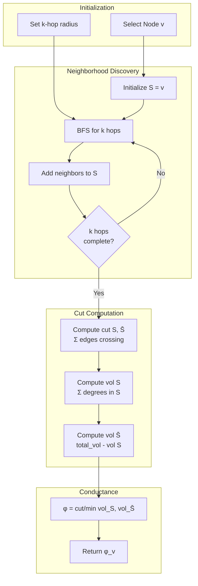

### 5.3 Conductance Analysis Example

**2-hop Neighborhood Analysis:**

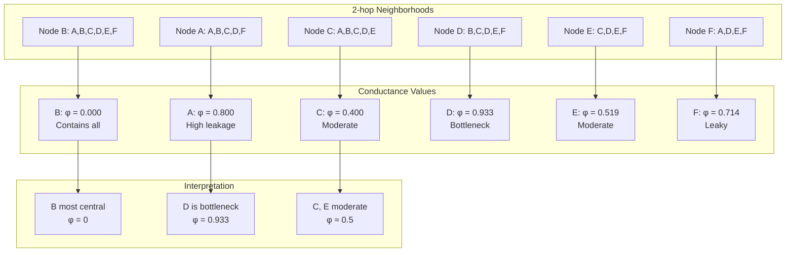

**Detailed Computation for Node B:**

- 2-hop neighborhood: {A, B, C, D, E, F} = entire graph
- Cut(S, S̄) = 0 (no edges leaving)
- Vol(S) = total edge weight = 5.7
- Vol(S̄) = 0
- Conductance: φ = 0/min(5.7, 0) = 0 (most cohesive)

---

## 6. Flow Centrality: Random Walk Analysis

### 6.1 Complete Theoretical Foundation

#### 6.1.1 Random Walk Formulation

Flow centrality via random walks:
$$FC(v) = \lim_{N \to \infty} \frac{1}{N \cdot L} \sum_{w=1}^{N} \sum_{t=1}^{L} \mathbb{1}[X_t^{(w)} = v]$$

Where:
- $N$ = number of walks
- $L$ = walk length
- $X_t^{(w)}$ = position at time $t$ in walk $w$

#### 6.1.2 Relationship to Stationary Distribution

For ergodic chains:
$$\lim_{t \to \infty} \Pr[X_t = v] = \pi_v$$

Where $\pi$ is the stationary distribution satisfying:
$$\pi = \mathbf{P}^T\pi$$

### 6.2 Monte Carlo Flow Algorithm

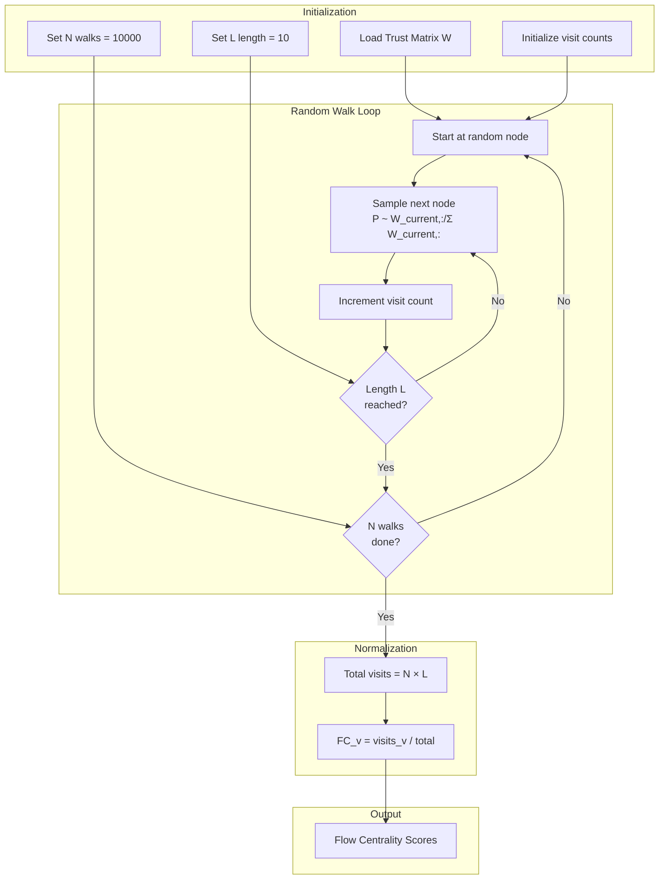

### 6.3 Flow Centrality Results

**Monte Carlo Simulation (10,000 walks, length 10):**

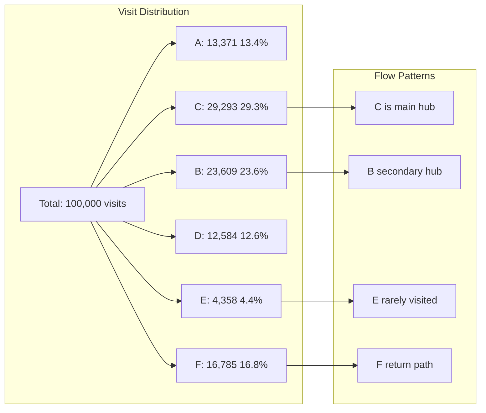

**Sample Walk Trajectories:**

| Walk | Path | Visits |
|------|------|--------|
| 1 | B→C→E→F→A→B→C→E→F→A | C:2, F:2, A:2, B:2, E:2 |
| 2 | D→E→F→A→B→C→E→F→A→B | F:2, A:2, B:2, C:1, D:1, E:2 |
| 3 | A→C→E→F→A→B→D→F→A→C | A:3, C:2, F:2, E:1, B:1, D:1 |

---

## 7. Hybrid Liquidity: Multi-Objective Optimization

### 7.1 Complete Theoretical Foundation

#### 7.1.1 Component Integration

$$L(v) = w_1 \cdot \hat{\phi}^{-1}(v) + w_2 \cdot \hat{FC}(v) + w_3 \cdot \hat{R}(v) + w_4 \cdot \hat{S}(v)$$

Where:
- $\hat{\phi}^{-1}(v)$: Inverted normalized conductance (cohesion)
- $\hat{FC}(v)$: Normalized flow centrality
- $\hat{R}(v)$: Normalized effective rate
- $\hat{S}(v)$: Normalized token supply

#### 7.1.2 Effective Rate Computation

$$\hat{R}(v) = \max_{c \in K} \{R(c, T(v)) \cdot \mathbb{1}[T^*(c \to v) \geq \tau]\}$$

Where $T^*(c \to v)$ is transitive trust from converter $c$ to token issuer $v$.

### 7.2 Hybrid Score Computation Flow

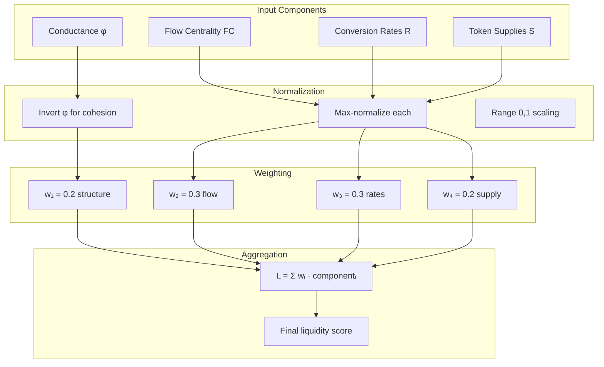

### 7.3 Complete Hybrid Example

**Given:**
- Token supplies: A:1000, B:200, C:300, D:800, E:400, F:100
- Conversion rates: B:1.0, D:0.9 (converters only)
- Conductance: From previous computation
- Flow centrality: From Monte Carlo

**Component Normalization:**

| Node | φ⁻¹ (norm) | FC (norm) | Rate (norm) | Supply (norm) |
|------|------------|-----------|-------------|---------------|
| A | 0.200 | 0.457 | 0.000 | 1.000 |
| B | 1.000 | 0.806 | 1.000 | 0.200 |
| C | 0.500 | 1.000 | 0.000 | 0.300 |
| D | 0.107 | 0.430 | 0.900 | 0.800 |
| E | 0.385 | 0.149 | 0.000 | 0.400 |
| F | 0.280 | 0.573 | 0.000 | 0.100 |

**Weighted Aggregation:**

$$L_A = 0.2(0.200) + 0.3(0.457) + 0.3(0.000) + 0.2(1.000) = 0.377$$
$$L_B = 0.2(1.000) + 0.3(0.806) + 0.3(1.000) + 0.2(0.200) = 0.782$$
$$L_C = 0.2(0.500) + 0.3(1.000) + 0.3(0.000) + 0.2(0.300) = 0.460$$
$$L_D = 0.2(0.107) + 0.3(0.430) + 0.3(0.900) + 0.2(0.800) = 0.580$$
$$L_E = 0.2(0.385) + 0.3(0.149) + 0.3(0.000) + 0.2(0.400) = 0.202$$
$$L_F = 0.2(0.280) + 0.3(0.573) + 0.3(0.000) + 0.2(0.100) = 0.248$$

**Final Ranking:**
1. **B: 0.782** (converter with excellent flow)
2. **D: 0.580** (converter with good supply)
3. **C: 0.460** (highest flow, no conversion)
4. **A: 0.377** (highest supply, poor position)
5. **F: 0.248** (moderate flow)
6. **E: 0.202** (poor connectivity)

---

## 8. Comparative Analysis and Case Studies

### 8.1 Algorithm Performance on Different Network Types

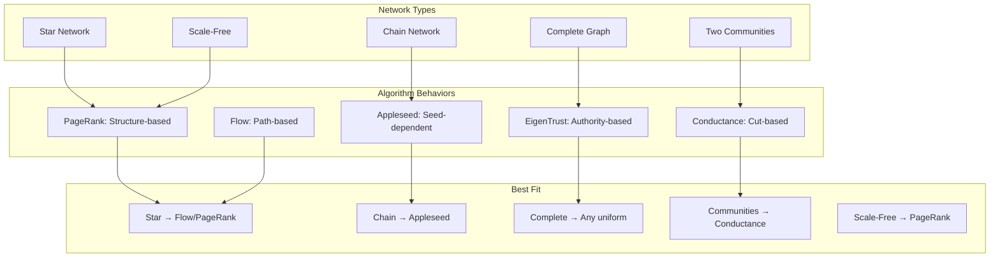

### 8.2 Sybil Attack Resistance Comparison

**Scenario:** 10% Sybil nodes with weak connection (0.01 weight) to honest network

| Algorithm | Configuration | Sybil Mass | Resistance |
|-----------|--------------|------------|------------|
| **EigenTrust** | α=0.15, p on honest | 8.6% | ✅ Excellent |
| **PageRank** | d=0.85, uniform | 48% | ❌ Poor |
| **PageRank** | d=0.85, personalized | 12% | ✅ Good |
| **Appleseed** | d=0.85, honest seeds | 5% | ✅ Excellent |
| **Conductance** | - | Identifies boundary | ✅ Detection |
| **Flow** | Natural resistance | 10% | ✅ Good |

### 8.3 Computational Complexity Summary

| Algorithm | Time per Iteration | Space | Convergence | Total |
|-----------|-------------------|-------|-------------|--------|
| **EigenTrust** | O(\|E\|) | O(\|E\|) | 45-90 iter | O(k\|E\|) |
| **PageRank** | O(\|E\|) | O(\|E\|) | 30-70 iter | O(k\|E\|) |
| **Appleseed** | O(\|E\|) | O(\|E\|) | 25-50 iter | O(k\|E\|) |
| **Conductance** | O(d^k\|V\|) | O(\|V\|) | 1 iter | O(d^k\|V\|) |
| **Flow (MC)** | O(1) per step | O(\|V\|) | N walks | O(N·L) |
| **Hybrid** | Sum of components | Max | Varies | Dominated by slowest |

### 8.4 Parameter Selection Guidelines

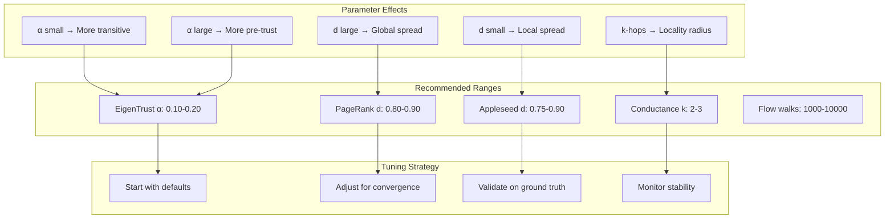

---

## Summary and Key Insights

### Algorithm Selection Decision Tree

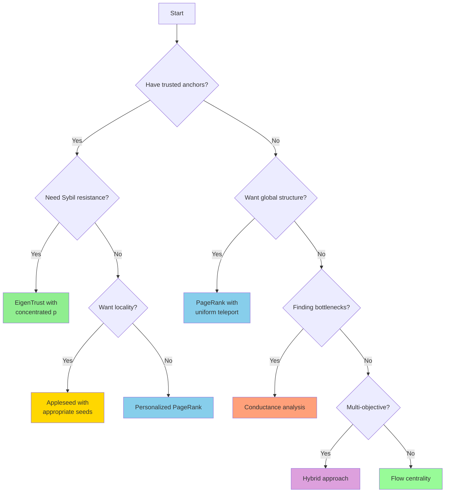

### Key Theoretical Results

1. **EigenTrust Convergence:** $O((1-\alpha)^k)$ with unique solution for $\alpha > 0$
2. **Appleseed Energy Conservation:** $\|e_t\|_1 = d^t$ guarantees termination
3. **PageRank Dangling Handling:** Essential for proper mass distribution
4. **Conductance-Spectrum Connection:** $\phi \in [\lambda_2/2, \sqrt{2\lambda_2}]$
5. **Flow-Stationary Equivalence:** Long walks approach stationary distribution
6. **Hybrid Normalization:** Critical for balanced component contribution

### Implementation Best Practices

1. **Always normalize** probability distributions at each iteration
2. **Use sparse matrices** for networks with $|E| \ll |V|^2$
3. **Monitor convergence** via L1 norm: $\|\mathbf{x}^{(k+1)} - \mathbf{x}^{(k)}\|_1 < \epsilon$
4. **Handle edge cases:** Dangling nodes, disconnected components, self-loops
5. **Cache computations:** Especially matrix decompositions and paths
6. **Validate parameters:** Test on small networks before scaling
7. **Profile memory:** Sparse operations can still consume significant memory
8. **Implement incrementally:** Support dynamic network updates
9. **Document assumptions:** Especially regarding directionality and weights
10. **Test robustness:** Perturb weights ±10% to assess stability